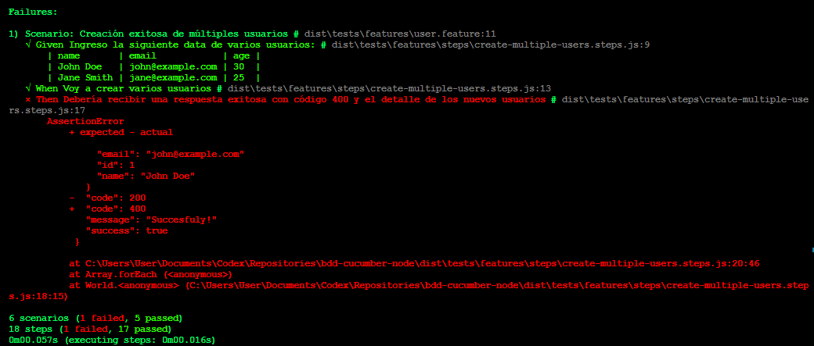

# Proyecto: BDD con Cucumber y Node.js

Este proyecto tiene como objetivo implementar pruebas de comportamiento (BDD - Behavior Driven Development) usando **Cucumber.js** junto con **TypeScript** y **Chai** como herramienta de aserción.

## 🎯 Objetivo del Proyecto

El propósito es probar funcionalidades de login y un CRUD de usuarios utilizando un enfoque de desarrollo guiado por comportamiento, lo cual permite:

- Validar el comportamiento esperado de la aplicación de forma legible.
- Generar documentación ejecutable.
- Facilitar la colaboración entre equipos técnicos y no técnicos.

---

## 📁 Estructura de Carpetas

```
bdd-cucumber-node/
│
├── package.json             # Configuración de dependencias y scripts
├── tsconfig.json            # Configuración de TypeScript
├── .gitignore
├── README.md
│
├── src/                     # Código fuente de la aplicación
│   └── app/
│         └── models/
│             └── user.model.ts #Modelo de un usuario
│         └── services/
│              └── login.service.ts  # Servicio de login simulado
│              └── login.service.ts  # Servicio de Usuarios simulado 
│
├── tests/                   # Pruebas
│   └── features/
│       ├── auth.feature     # Archivo con el escenario en lenguaje Gherkin
│       ├── user.feature     # Archivo con el escenario en lenguaje Gherkin
│       └── steps/
│           └── auth.steps.ts # Definición de los pasos en TypeScript
│           └── create-multiple-users.steps.ts # Definición de los pasos en TypeScript
│           └── create-user.steps.ts # Definición de los pasos en TypeScript
│           └── get-all-users.steps.ts # Definición de los pasos en TypeScript
```

---

## 🧩 Librerías y Dependencias

El proyecto usa las siguientes dependencias:

| Paquete              | Uso |
|----------------------|-----|
| `@cucumber/cucumber` | Motor de pruebas BDD (Cucumber.js) |
| `chai`               | Librería de aserciones |
| `copyfiles`          | Copia archivos `.feature` a `dist` |
| `rimraf`             | Limpia carpetas (`dist`) antes de cada build |
| `typescript`         | Transpilador de TS a JS |
| `@types/node`, `@types/chai` | Tipado para Node y Chai |

Para instalarlas se usa el siguiente comando:

```bash
npm install
```

---

## ▶️ Scripts Disponibles

El archivo `package.json` contiene varios scripts útiles:

```json
"scripts": {
  "clean-dist": "rimraf dist/tests/features",
  "create-dist": "mkdir dist\\tests\\features",
  "copy-features": "copyfiles tests/features/*.feature dist",
  "test": "npm run clean-dist && npm run create-dist && npm run copy-features && tsc && cucumber-js dist/tests/features --publish-quiet"
}
```

### Cómo ejecutar las pruebas

1. Compila el proyecto y ejecuta las pruebas con:

```bash
npm test
```

Este comando realiza:

- Limpieza de la carpeta `dist`
- Creación de estructura para los archivos `.feature`
- Copia de archivos `.feature` al `dist`
- Transpilación de TypeScript
- Ejecución de las pruebas con Cucumber.js

---

## 🧪 Escenario de Prueba (`auth.feature`)

```gherkin
Feature: Autenticar usuarios

    Scenario: Usuario ingresa credenciales válidas y la autenticación es exitosa
        Given Un servicio de login
        When Usuario ingresa "admin" y "admin"
        Then El servicio debe responder con código 200

    Scenario: Usuario ingresa credenciales inválidas y la autenticación no es exitosa
        Given Un servicio de login
        When Usuario ingresa "admin1" y "admin2"
        Then El servicio debe responder con código 401
```

## 🧪 Escenario de Prueba (`user.feature`)

```gherkin
Feature: Crear Usuario
    Como administrador del sistema
    Quiero crear un nuevo usuario
    Para que el usuario pueda acceder al sistema

    Scenario: Creación exitosa de un nuevo usuario
        Given Ingreso información válida de un usuario como nombre "Jhonata Valencia", email "jhonatan.valencia@pragma.com.co", edad 24
        When Voy a crear un nuevo usuario
        Then Debería recibir una respuesta exitosa con código 200 y el detalle del nuevo usuario

    Scenario: Creación exitosa de múltiples usuarios
        Given Ingreso la siguiente data de varios usuarios:
            | name       | email            | age |
            | John Doe   | john@example.com | 30  |
            | Jane Smith | jane@example.com | 25  |
        When Voy a crear varios usuarios
        Then Debería recibir una respuesta exitosa con código 200 y el detalle de los nuevos usuarios

    @emptyList
    Scenario: Obtener lista de usuarios vacía
        Given No hay usuarios registrados
        When Quiero obtener el listado de usuarios
        Then Deberia obtener una respuesta con código 404

    Scenario: Obtener listado de usuarios
        Given Estan registrados los siguientes usuarios:
            | name       | email            | age |
            | John Doe   | john@example.com | 30  |
            | Jane Smith | jane@example.com | 25  |
        When Quiero obtener el listado de usuarios
        Then Deberia obtener una respuesta con código 200 y los siguientes usuarios:
            | name       | email            | age |
            | John Doe   | john@example.com | 30  |
            | Jane Smith | jane@example.com | 25  |
```

Al ejecutar los tests debe salir en consola una respuesta como la siguiente en caso de que todos los tests hayan sigo exitosos:


Si alguno o varios de los casos de prueba fallan, la respuesta sería como el siguiente ejemplo:



---

## 🧠 Buenas prácticas aplicadas

- **Separación de responsabilidades**: lógica del servicio (`src`) y pruebas (`tests`).
- **Transpilación segura**: uso de TypeScript y control de tipado.
- **Independencia de pruebas**: pruebas corren desde `dist` para evitar dependencias del entorno fuente.
- **Automatización del flujo de pruebas** con scripts de NPM.

---

## 🧾 Requisitos

- Node.js >= 18.x
- npm >= 9.x

---

## 🙋 Autor

**Jhonatan Valencia Arango**
