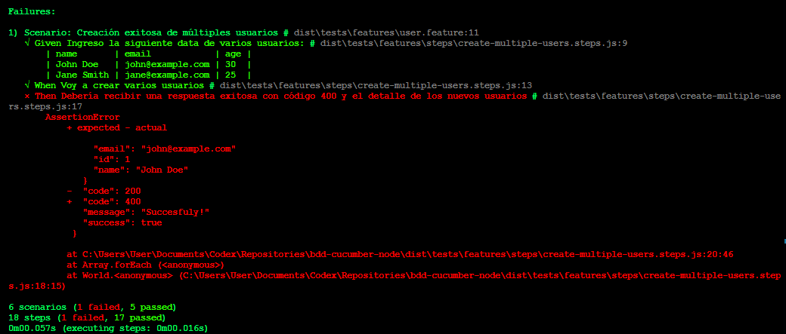

## 🧪 Escenario de Prueba (`auth.feature`)

```gherkin
Feature: Autenticar usuarios

    Scenario: Usuario ingresa credenciales válidas y la autenticación es exitosa
        Given Un servicio de login
        When Usuario ingresa "admin" y "admin"
        Then El servicio debe responder con código 200

    Scenario: Usuario ingresa credenciales inválidas y la autenticación no es exitosa
        Given Un servicio de login
        When Usuario ingresa "admin1" y "admin2"
        Then El servicio debe responder con código 401
```

## 🧪 Escenario de Prueba (`user.feature`)

```gherkin
Feature: Crear Usuario
    Como administrador del sistema
    Quiero crear un nuevo usuario
    Para que el usuario pueda acceder al sistema

    Scenario: Creación exitosa de un nuevo usuario
        Given Ingreso información válida de un usuario como nombre "Jhonata Valencia", email "jhonatan.valencia@pragma.com.co", edad 24
        When Voy a crear un nuevo usuario
        Then Debería recibir una respuesta exitosa con código 200 y el detalle del nuevo usuario

    Scenario: Creación exitosa de múltiples usuarios
        Given Ingreso la siguiente data de varios usuarios:
            | name       | email            | age |
            | John Doe   | john@example.com | 30  |
            | Jane Smith | jane@example.com | 25  |
        When Voy a crear varios usuarios
        Then Debería recibir una respuesta exitosa con código 200 y el detalle de los nuevos usuarios

    @emptyList
    Scenario: Obtener lista de usuarios vacía
        Given No hay usuarios registrados
        When Quiero obtener el listado de usuarios
        Then Deberia obtener una respuesta con código 404

    Scenario: Obtener listado de usuarios
        Given Estan registrados los siguientes usuarios:
            | name       | email            | age |
            | John Doe   | john@example.com | 30  |
            | Jane Smith | jane@example.com | 25  |
        When Quiero obtener el listado de usuarios
        Then Deberia obtener una respuesta con código 200 y los siguientes usuarios:
            | name       | email            | age |
            | John Doe   | john@example.com | 30  |
            | Jane Smith | jane@example.com | 25  |
```

Al ejecutar los tests debe salir en consola una respuesta como la siguiente en caso de que todos los tests hayan sigo exitosos:


Si alguno o varios de los casos de prueba fallan, la respuesta sería como el siguiente ejemplo:



---